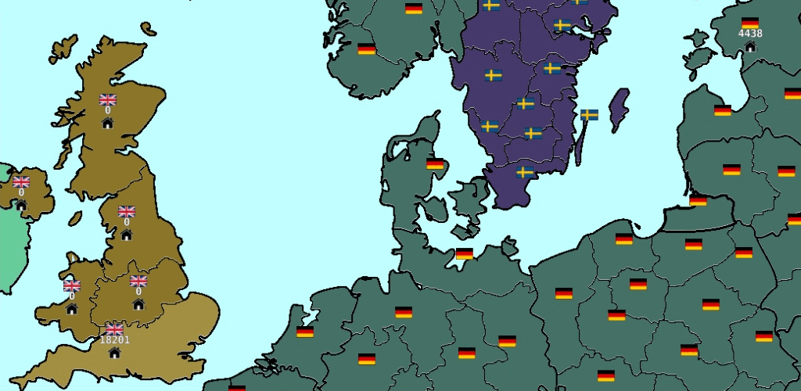

# О разработчике

### Кто такой jalhund?

Просто парень, который любит пошаговые стратегии, и начал пилить свою в свободное от учёбы время

### Расскажи о сбее

Когда мне было 17-18, я создал первую игру. Это Civilization Path ( вы можете найти ее здесь: [https://play.google.com/store/apps/details?id=com.DenisMakhortov.CivilizationPath](https://play.google.com/store/apps/details?id=com.DenisMakhortov.CivilizationPath))

<figure><figcaption>
Civilization Path
</figcaption></figure>

Да, она не очень красивая. Но нашлось много людей, которым она понравилась. Я был студентом и решил создать другую игру: более интересную и детализированную

Спустя 1 год я выпустил новую игру: Cold Path (Google Play link: [https://play.google.com/store/apps/details?id=com.DenisMakhortov.ColdPath](https://play.google.com/store/apps/details?id=com.DenisMakhortov.ColdPath))

<figure><figcaption>
Cold Path
</figcaption></figure>

Она намного лучше и детализированнее. Также вы можете создавать свои карты, сценарии и даже сервера. Исходники редактора карт и сервера доступны на github.\
Вы можете прочитать больше про создание Cold Path здесь: [https://forum.defold.com/t/cold-path-turn-based-multiplayer-strategy/65722?u=denis\_makhortov](https://forum.defold.com/t/cold-path-turn-based-multiplayer-strategy/65722?u=denis\_makhortov)

### Сколько человек разрабатывает игру?

Я один, но делал в одиночку не абсолютно все.

Музыку создавал не я, ее авторы указаны в меню Об игре. Некоторые внутриигровые сценарии создавал не я, а игроки в редакторе сценариев. Их авторы также написаны в том меню

Также очень много крутых идей писали игроки. Всех расписать не получится, но знайте, что я вам очень благодарен за поддержку и помощь в разработке.

### На чем ты делаешь игру?

Игровой движок: Defold

Язык программирования: Lua

Для вещей, недоступных в движке, есть возможность писать нативные расширения на C/C++

Движок мне очень нравится, идеально подходит для 2D игр. Вначале все сложно и непонятно, но со временем начинаешь ценить скорость разработки и другие его преимущества

### Код игры открыт или закрыт?

Код самой игры закрыт. Открывать не планирую, так как на разработку было потрачено много времени. В самой игре есть покупки, деньги с них идут на аренду серверов, разработку игры и т.д.

Код сервера открыт. Сервер - это ядро игры с небольшими скриптами вокруг. Я открыл его, чтобы дать больше возможностей игрокам для изменения игрового процесса. Теперь, когда код сервера открыт, каждый может запустить свой сервер и использовать его, как душе угодно

Код редактора карт открыт. Используйте его, как хотите.

**Могу взять за основу код сервера или редактора карт, чтобы на его основе сделать свою игру?**

Да. Я буду рад, что в мире станет на одну хорошую игру больше

### Какие планы на будущее?

Запилить Cold Path 2, но времени свободного очень мало.
