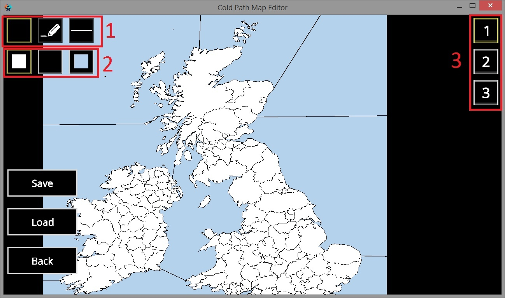

# Установить изображение

Для того, чтобы создать карту, я очень рекомендую найти что-то, что вы возьмете за основу. \(В данном случае будет использоваться карта британских островов. Скачать ее можно тут: [https://raw.githubusercontent.com/JAlHund/cold-path-map-editor/main/source.png](https://raw.githubusercontent.com/JAlHund/cold-path-map-editor/main/source.png)\)  
Требования к изображению:  
1\) меньше 4096x4096  
2\) Границы должны быть залиты чистым черным \(RGB: 0, 0, 0\)  
3\) Сухопутные провинции чистым белым \(RGB: 255, 255, 255\)  
4\) Водные провинции должны быть залиты этим цветом \(RGB: 180, 210, 236\)  
  
После того, как вы нашли подходящее изображение, закиньте его в нужную папку \(подробнее разделе Обзор\) и переименуйте в source.png  
Далее запустите редактор и выберите Map Creator.  
  
Если загруженное изображение меньше 4096x4096, то оно появится в левом нижнем углу. В этом ничего страшного нет! Ограничения в игре выставятся нормально. Просто используемое пространство меньше максимального  
  
Если вы хотите отредактировать карту, то нажмите Image Editor. В этом меню вы можете редактировать изображение, сохранять его \(не саму карту, а именно изображение карты, модифицированное изображение, которые вы загрузили\) с помощью кнопки Save или подгружать с помощью кнопки Load  
  
Описание кнопок на скрине:  
1. Инструмент: ничего \(просмотр\), карандаш, линия  
2. Цвет: цвет сухопутных провинций, цвет границ, цвет воды  
3. Размер карандаша

