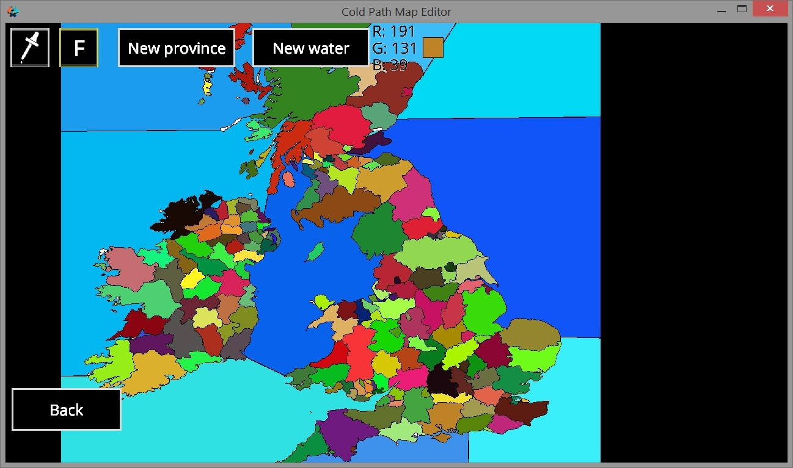

# Setting up provinces

When you think the map is drawn correctly, press back \(if you are in the image editing menu\). Next, click Autogenerate. The editor will automatically divide the map into provinces. If you want to combine territories into one province \(for example, islands\), then click the Province Editor, click on the dropper icon at the top, click on the province to which you want to assign something. The color will be captured, then click on the top F \(fill\) and click on the territory that you want to refer to the province Usually autogeneration does a good job if the map is drawn correctly.

The New province button sets the fill color to the new color of the land province. \(In the map editor at this stage, each territory should have its own unique color, since the editor distinguishes provinces by it. If different territories have the same color, the editor will count them as one province. He also divides provinces by color. If a province water, then its blue color in RGB format must be greater than or equal to 225\) If autogeneration did not fill the required territory, and you want it to have a land border. Then press this button and fill the desired territory. The New water button sets the fill color to the new color of the water province.

After you have done everything, click the Export map button and wait, all the necessary files will be written to the exported\_map folder

