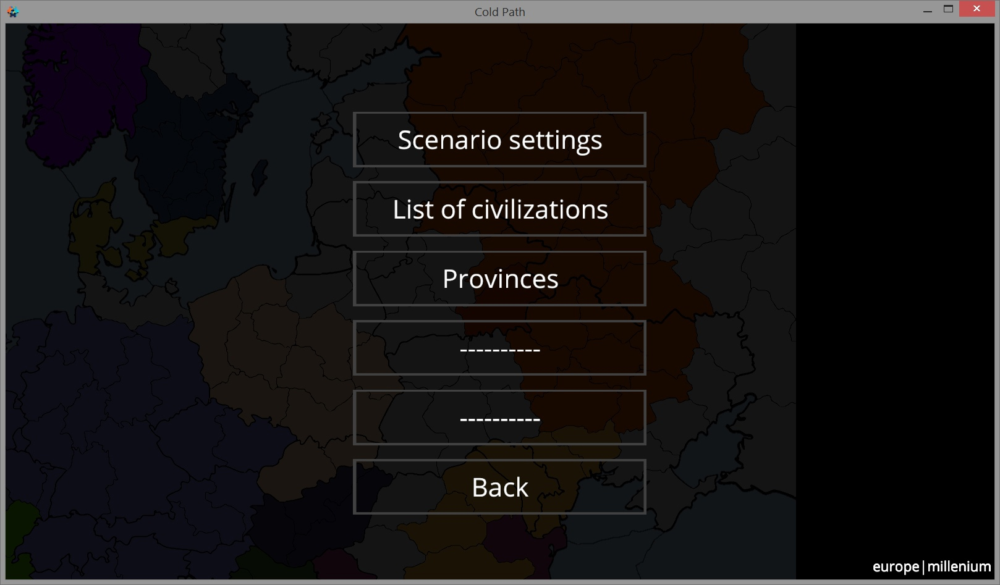

# Редактор сценариев

Зайти в редактор сценариев можно следующим образом: Настройки - Dev menu - Scenario editor. Дальше на экране появится меню редактора. Сейчас распишу меню редактора понятным языком. Все Dev menu \(меню разработчика\) сделано на английском языке. Я не знаю, буду ли переводить эту часть или нет, не хотелось бы увеличивать размер данных, необходимых для перевода игры.

1. Set map \(выбор карты\)
2. Load scenario \(загрузить какой-либо сценарий из существующих. Можно загрузить опред. сценарий и уже на его основе создать свой\)
3. Edit scenario \(редактировать сценарий\)
4. Save scenario \(JSON\) \(сохранить сценарий в формате json. Файлы этого формата можно экспортировать с помощью кнопки Load scenario в Dev\_menu. Это формат данных для загрузки сценария в клиенте игры\)
5. Save scenario \(Lua\) \(этот формат сценариев пригодится тем, кто хочет создать сценарий для своего сервера. Файл этого формата можно будет закинуть в папку сценариев сервера и играть по интернету на этом сценарии\)
6. Menu \(выйти в главное меню игры\)

Теперь разберем подробнее меню Edit scenario \(редактировать сценарий\).

1. Scenario settings \(настройки сценария. Здесь можно изменить название сценария и год начала\)  
2. List of civilizations \(список стран. Тут можно добавить новую страну, изменить существующую или удалить\)  
3. Provinces \(открыть карту для редактирования принадлежности провинций\)  
4. Еще не готово.  
5. Еще не готово. Тут можно будет добавить что-то еще  
6. Back \(назад\)

Пройдем по этим пунктам еще подробнее:

1. Scenario settings. Здесь существует следующее: Scenario id - это название сценария. Вы можете его изменить на любой другой. Year - год начала. Technology level \(0-21\) - здесь можно указать уровень технологий, открытых по умолчанию в игре
2. List of civilizations. Здесь находится список стран. Если выбрать какую-то страну из списка, то можно изменить ее название, цвет или удалить страну из списка. Внизу есть кнопка Create - она добавляет новую страну. Дальше вы можете ее отредактировать так, как вам нужно
3. Provinces. При переходе сюда открывается карта. Сверху есть две кнопки. Одна пустая, а вторая со значком карандаша. Если нажать первую, то при выборе провинции ничего происходить не будет. А если вторую, то при клике на провинцию она станет принадлежать той стране, что написана внизу экрана. При нажатии на кнопку Civilization можно выбрать страну из списка для редактирования или создать новую

Создание сценария кратко:  
1. Настройки - Dev menu - Scenario editor Выбираете карту и сценарий и редактируете  
2. В меню редактора не забываете нажать кнопку Save scenario \(JSON\), чтобы сохранить данные сценария по пути, который снизу слева. \(если у вас не сохраняет, то проверьте разрешение приложения на запись файлов\)  
3. Заходите в Настройки - Dev menu. Выбираете Load scenario. Сценарий автоматически загрузится по тому пути, по которому обычно экспортируется. Удалить сценарий можно кнопкой Remove custom scenario. Загруженный сценарий появится в меню создания игры. Его можно будет выбирать точно так же, как и встроенные в игру \(сценарий можно будет еще выбрать для редактирования в редакторе сценариев. Но после этого обязательно нужно будет его сохранить, удалить последний и загрузить файл\)

