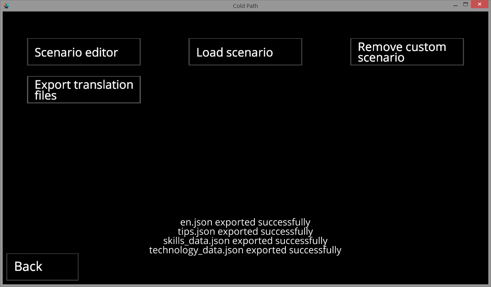

# Adding custom translation to game

### Export translation files

First, you need to get the translation files of the game, so that later they can be changed and loaded into the game. Open: Settings - Dev Menu. Press Export translation files. A message will appear on the screen that the files were exported successfully.

### Change translation

Next, you need to find the exported translation files and modify them. Open the file manager and find the files in path:  
`Android/data/com.DenisMakhortov.ColdPath/files/`

There will be several files in JSON format, they store the translation. You need to change their content.

For example, it was:

`"scenario": "Scenario",`

Became:

`"scenario": "my_cool_translation",`

I think enough changes for today. Save changes.

### Using translation in game

After changing the files, open game \(or restart if it was not closed\). Open the Settings. The Custom language will appear in the list of available languages, select it. If the Custom language does not appear, then check the JSON files in one of the JSON Parser Online, most likely the comma or quotes were removed when changing.

Custom translation completed successfully.

### How to add translation to official version of game?

If you have completed the translation and want me to add it to the official version of the game, then write to me by mail or in Discord. Send the translation files and write how I should indicate you in the menu About the game

